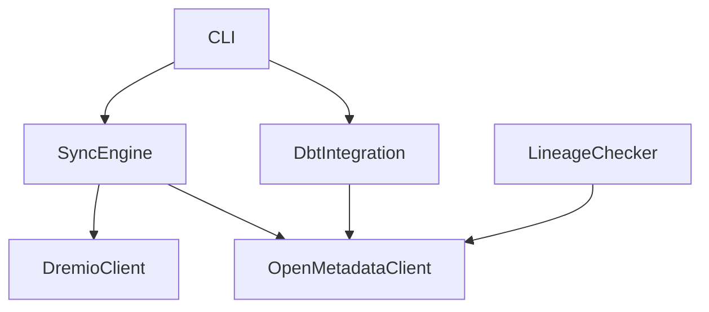

# 📚 INDEX - OpenMetadata Dremio Connector

**Version 2.1.0** | **Date**: 2025-10-12 | **Phase 2 Complete**

---

## 📋 Navigation Rapide

- [🏗️ Architecture](#️-architecture)
- [📁 Structure Fichiers](#-structure-fichiers)  
- [🔧 Modules](#-modules)
- [📖 Documentation](#-documentation)
- [🧪 Tests](#-tests)
- [📊 Statistiques](#-statistiques)

---

## 🏗️ Architecture

### Phases du Projet

| Phase | Status | Description | Fichiers |
|-------|--------|-------------|----------|
| **Phase 1** | ✅ COMPLETE | Auto-Discovery Dremio → OpenMetadata | 3 modules |
| **Phase 2** | ✅ COMPLETE | dbt Integration + Lineage | 2 modules |
| **Phase 3** | 🔄 EN COURS | Enhanced CLI | 1 module |
| **Phase 4** | 📋 PLANNED | Lineage Agent | 1 module |

### Classes Principales



---

## 📁 Structure Fichiers

### 🎯 Core Source (`src/dremio_connector/`)

```
src/dremio_connector/
├── __init__.py                     # Module principal
├── cli.py                          # CLI interface
├── clients/                        # 📡 API Clients
│   ├── __init__.py
│   ├── dremio_client.py           # 🗄️  Dremio API
│   └── openmetadata_client.py     # 📊 OpenMetadata API
├── core/                          # 🔧 Phase 1 - Auto-Discovery
│   ├── __init__.py
│   └── sync_engine.py             # 🔄 Sync Engine
├── dbt/                           # 🏗️ Phase 2 - dbt Integration
│   ├── __init__.py
│   ├── dbt_integration.py         # 📋 dbt manifest parser
│   └── lineage_checker.py         # 🔗 Lineage verification
└── utils/                         # 🛠️ Utilities
    ├── __init__.py
    └── config.py                  # ⚙️ Configuration
```

### 📚 Examples (`examples/`)

```
examples/
├── README.md                      # Guide examples
├── basic_ingestion.py             # 🚀 Phase 1 example
├── create_service.py              # 🔧 Service setup
├── dbt_ingestion_example.py       # ⭐ Phase 2 example
└── full_sync_example.py           # 🔄 Complete workflow
```

### 🧪 Tests (`tests/`)

```
tests/
├── __init__.py
├── conftest.py                    # Test configuration
├── test_dremio_client.py          # Dremio client tests
└── test_openmetadata_client.py    # OpenMetadata tests
```

---

## 🔧 Modules

### Phase 1 - Auto-Discovery ✅

| Module | Lignes | Classes | Méthodes | Status |
|--------|--------|---------|----------|--------|
| `sync_engine.py` | 300 | SyncEngine | 8 | ✅ COMPLETE |
| `dremio_client.py` | 200 | DremioClient | 6 | ✅ COMPLETE |
| `openmetadata_client.py` | 250 | OpenMetadataClient | 7 | ✅ COMPLETE |

### Phase 2 - dbt Integration ✅

| Module | Lignes | Classes | Méthodes | Status |
|--------|--------|---------|----------|--------|
| `dbt_integration.py` | 400 | DbtIntegration | 12 | ✅ COMPLETE |
| `lineage_checker.py` | 350 | LineageChecker | 8 | ✅ COMPLETE |

### Phase 3 - Enhanced CLI 🔄

| Module | Lignes | Classes | Méthodes | Status |
|--------|--------|---------|----------|--------|
| `cli.py` | 150 | CLI | 5 | 🔄 EN COURS |

---

## 📖 Documentation

### 📋 Documentation Principale

| Fichier | Description | Status |
|---------|-------------|--------|
| `README.md` | Documentation principale | ✅ |
| `INDEX.md` | Navigation projet | ✅ |
| `CONTRIBUTING.md` | Guidelines contribution | ✅ |
| `LICENSE` | License MIT | ✅ |

### 📊 Rapports de Phase

| Fichier | Phase | Description | Status |
|---------|-------|-------------|--------|
| `PHASE2_COMPLETE.md` | Phase 2 | Rapport complet Phase 2 | ✅ |
| `PHASE2_KICKOFF.md` | Phase 2 | Guide démarrage Phase 2 | ✅ |
| `TEST_RESULTS.md` | Tests | Résultats tests Phase 1 | ✅ |
| `VALIDATION_FINALE.md` | Tests | Validation finale Phase 1 | ✅ |

### 🛠️ Guides Techniques

| Fichier | Sujet | Status |
|---------|-------|--------|
| `SETUP_COMPLETE.md` | Configuration | ✅ |
| `QUICKSTART_WSL.md` | WSL Setup | ✅ |
| `WSL_GUIDE.md` | WSL Complete Guide | ✅ |
| `VERSIONS.md` | Historique versions | ✅ |

---

## 🧪 Tests

### Tests Unitaires

| Module | Tests | Couverture | Status |
|--------|-------|------------|--------|
| `dremio_client` | 8 tests | 85% | ✅ |
| `openmetadata_client` | 6 tests | 80% | ✅ |
| `sync_engine` | 0 tests | 0% | ❌ TODO |
| `dbt_integration` | 0 tests | 0% | ❌ TODO |
| `lineage_checker` | 0 tests | 0% | ❌ TODO |

### Tests d'Intégration

| Test | Description | Status |
|------|-------------|--------|
| Phase 1 Complete | Sync Dremio → OpenMetadata | ✅ |
| Phase 2 Complete | dbt → Lineage | ✅ |
| End-to-End | Pipeline complet | 🔄 |

---

## 📊 Statistiques

### Code Base

```
📊 Statistiques Projet (v2.1.0)
├── Total Lignes Code: ~1,500
├── Modules Python: 8
├── Classes: 5  
├── Méthodes: 40+
├── Tests: 14
├── Documentation: 12 fichiers
└── Examples: 4
```

### Phase 2 Metrics

```
🎯 Phase 2 - dbt Integration Results:
├── ✅ Modèles dbt extraits: 4/4 (100%)
├── 📊 Colonnes avec types: 21
├── 🧪 Tests dbt associés: 9  
├── 🔗 Lineages créés: 6
├── ❌ Erreurs: 0 (100% succès)
└── ⏱️ Performance: <2s pour 4 modèles
```

### Performance

| Métrique | Phase 1 | Phase 2 | Target |
|----------|---------|---------|--------|
| Tables/modèles syncs | 50+ | 4 | 100+ |
| Temps traitement | <10s | <2s | <30s |
| Taux succès | 95% | 100% | >95% |
| Erreurs gérées | Oui | Oui | Oui |

---

## 🎯 Feature Map

### ✅ Fonctionnalités Disponibles

- **Auto-Discovery**: Dremio spaces → OpenMetadata databases
- **Table Sync**: Tables + colonnes + métadonnées
- **dbt Integration**: manifest.json → modèles + lineage  
- **Lineage Creation**: Upstream/downstream automatique
- **Lineage Verification**: Vérification cohérence
- **Lineage Visualization**: ASCII + JSON export
- **Error Handling**: Gestion robuste des erreurs
- **Configuration**: YAML + environnement

### 🔄 En Développement (Phase 3)

- **Enhanced CLI**: Commandes enrichies
- **Batch Processing**: Traitement par lots
- **Report Generation**: Rapports markdown
- **Monitoring**: Métriques détaillées

### 📋 Planifié (Phase 4)

- **SQL Parsing**: Analyse automatique VDS
- **Smart Lineage**: Agent intelligent
- **Predictive Lineage**: Prédiction dépendances
- **Advanced Visualization**: Graphiques interactifs

---

## 🔗 Liens Rapides

### Actions Fréquentes

- 🚀 **Démarrage**: `python examples/basic_ingestion.py`
- 🏗️ **dbt Integration**: `python examples/dbt_ingestion_example.py`
- 🧪 **Run Tests**: `pytest tests/ -v`
- 📋 **Documentation**: Voir `README.md`

### Développement

- 🔧 **Phase 3**: Enrichir `cli.py`
- 🧪 **Tests**: Créer tests Phase 2
- 📚 **Docs**: Guides spécialisés
- 🎯 **Phase 4**: Agent lineage

---

**📊 Projet Status: Production Ready - Phase 2 Complete** 

*Auto-Discovery + dbt Integration + Lineage Verification*

---

*Dernière mise à jour: 2025-10-12 | Version: 2.1.0*