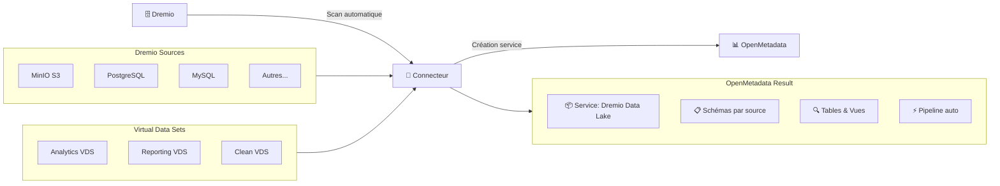
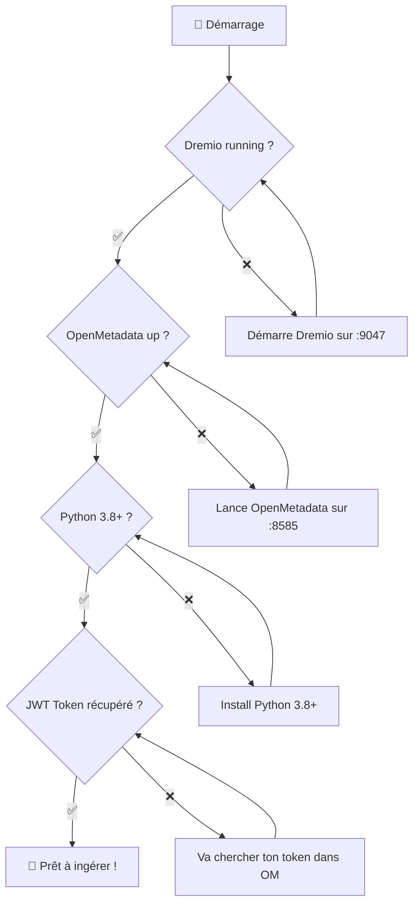
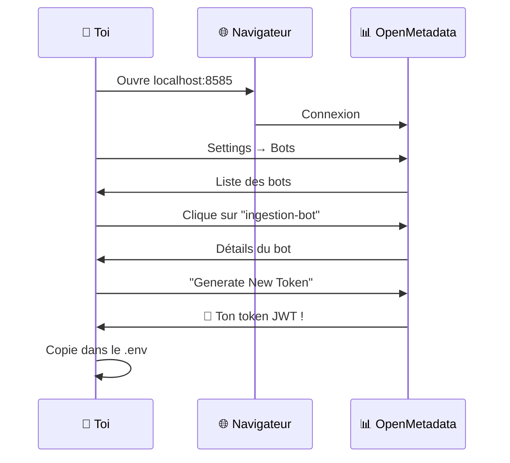
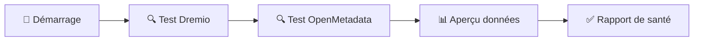
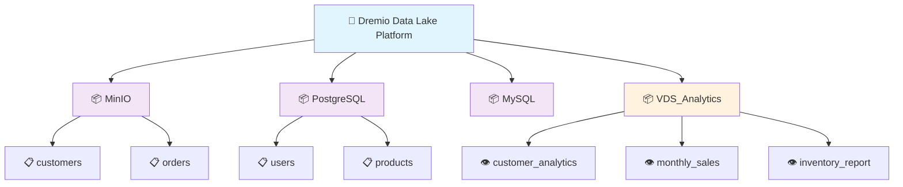
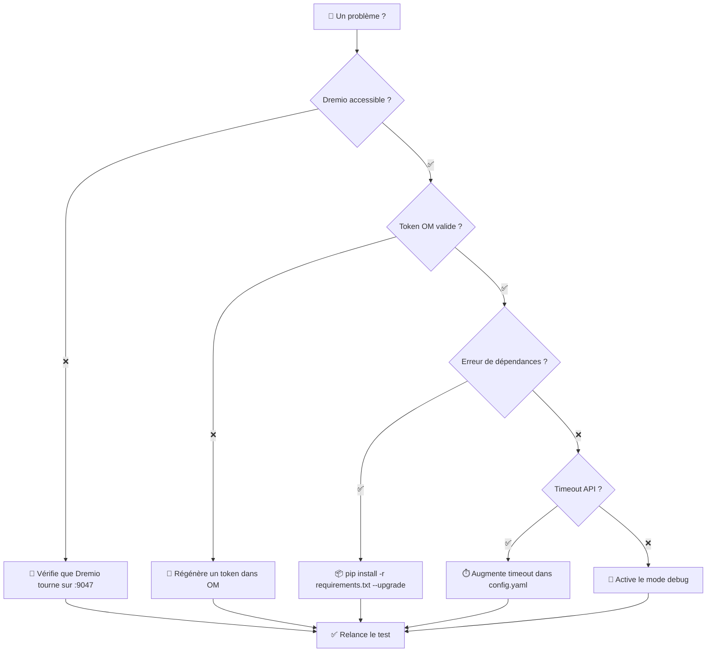
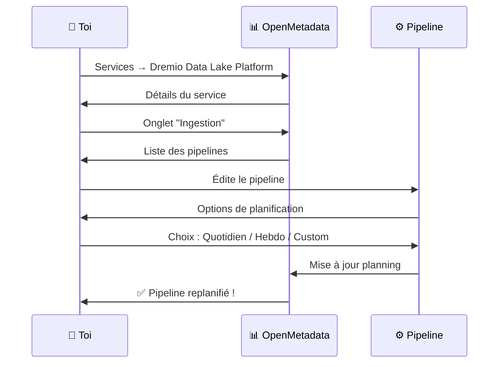

# ---
# English Translation

## Dremio to OpenMetadata | Automatic Ingestion Connector

### 📦 Requirements

This project requires Python 3.8+ (tested up to 3.13). Using a virtual environment is strongly recommended:

```bash
python -m venv venv_dremio
venv_dremio\Scripts\activate  # Windows
source venv_dremio/bin/activate  # Linux/Mac
pip install -r requirements.txt
```

**Key dependencies:**

- `requests` (Dremio & OpenMetadata API)
- `python-dotenv` (environment variables)
- `pyarrow`, `pandas`, `polars` (data processing)
- `PyYAML` (YAML parsing)
- `psycopg2-binary`, `opensearch-py`, `elasticsearch` (DB connectors)
- `colorlog`, `structlog` (advanced logging)
- `pytest`, `pytest-cov` (testing, optional)
- See `requirements.txt` for the full list and exact versions.

**Notes:**
- Compatible with Python 3.8 to 3.13
- PyDremio (Arrow Flight API) requires Python 3.12+ and Dremio Arrow Flight enabled (port 32010)
- For full OpenMetadata ingestion, uncomment the `openmetadata-ingestion[...]` line in `requirements.txt` (optional, heavy)


...existing code...


# ---
# Traducción al Español

## Dremio a OpenMetadata | Conector de Ingesta Automática

### 📦 Requisitos

Este proyecto requiere Python 3.8+ (probado hasta 3.13). Se recomienda encarecidamente usar un entorno virtual:

```bash
python -m venv venv_dremio
venv_dremio\Scripts\activate  # Windows
source venv_dremio/bin/activate  # Linux/Mac
pip install -r requirements.txt
```

**Dependencias principales:**

- `requests` (API de Dremio y OpenMetadata)
- `python-dotenv` (variables de entorno)
- `pyarrow`, `pandas`, `polars` (procesamiento de datos)
- `PyYAML` (análisis YAML)
- `psycopg2-binary`, `opensearch-py`, `elasticsearch` (conectores de BD)
- `colorlog`, `structlog` (logging avanzado)
- `pytest`, `pytest-cov` (pruebas, opcional)
- Consulte `requirements.txt` para la lista completa y versiones exactas.

**Notas:**
- Compatible con Python 3.8 a 3.13
- PyDremio (API Arrow Flight) requiere Python 3.12+ y Arrow Flight activado en Dremio (puerto 32010)
- Para la ingesta completa de OpenMetadata, descomente la línea `openmetadata-ingestion[...]` en `requirements.txt` (opcional, pesado)


...existing code...


# ---
# الترجمة إلى العربية

## دريمو إلى أوبن ميتاداتا | موصل الاستيعاب التلقائي

### 📦 المتطلبات

يتطلب هذا المشروع Python 3.8 أو أحدث (تم اختباره حتى 3.13). يوصى بشدة باستخدام بيئة افتراضية:

```bash
python -m venv venv_dremio
venv_dremio\Scripts\activate  # Windows
source venv_dremio/bin/activate  # Linux/Mac
pip install -r requirements.txt
```

**أهم الاعتمادات:**

- `requests` (واجهة برمجة تطبيقات Dremio وOpenMetadata)
- `python-dotenv` (متغيرات البيئة)
- `pyarrow`، `pandas`، `polars` (معالجة البيانات)
- `PyYAML` (تحليل YAML)
- `psycopg2-binary`، `opensearch-py`، `elasticsearch` (موصلات قواعد البيانات)
- `colorlog`، `structlog` (تسجيل متقدم)
- `pytest`، `pytest-cov` (اختبار، اختياري)
- راجع ملف `requirements.txt` للحصول على القائمة الكاملة والإصدارات الدقيقة.

**ملاحظات:**
- متوافق مع Python 3.8 إلى 3.13
- يتطلب PyDremio (واجهة Arrow Flight) Python 3.12+ وتفعيل Arrow Flight في Dremio (المنفذ 32010)
- لاستيعاب OpenMetadata الكامل، قم بإلغاء التعليق على سطر `openmetadata-ingestion[...]` في `requirements.txt` (اختياري، ثقيل)


...existing code...


# Dremio vers OpenMetadata | Connecteur d'Ingestion Automatique

## 📦 Requirements

Le projet nécessite Python 3.8+ (testé jusqu'à 3.13). Il est fortement recommandé d'utiliser un environnement virtuel :

```bash
python -m venv venv_dremio
venv_dremio\Scripts\activate  # Windows
source venv_dremio/bin/activate  # Linux/Mac
pip install -r requirements.txt
```

**Principales dépendances :**

- `requests` (API Dremio & OpenMetadata)
- `python-dotenv` (variables d'environnement)
- `pyarrow`, `pandas`, `polars` (traitement de données)
- `PyYAML` (parsing YAML)
- `psycopg2-binary`, `opensearch-py`, `elasticsearch` (connecteurs DB)
- `colorlog`, `structlog` (logging avancé)
- `pytest`, `pytest-cov` (tests, optionnel)
- Voir le fichier `requirements.txt` pour la liste complète et les versions exactes.

**Notes :**
- Compatible Python 3.8 à 3.13
- PyDremio (API Arrow Flight) nécessite Python 3.12+ et Dremio Arrow Flight activé (port 32010)
- Pour l'ingestion OpenMetadata complète, décommentez la ligne `openmetadata-ingestion[...]` dans `requirements.txt` (optionnel, lourd)


Ce connecteur permet l'intégration automatisée des sources Dremio et des Virtual Data Sets (VDS) dans OpenMetadata, en exposant chaque source comme un service CustomDB. Il s'adresse aux équipes souhaitant industrialiser la gestion de leurs métadonnées Dremio dans OpenMetadata.


## Fonctionnalités principales



- Découverte automatique de toutes les sources Dremio configurées
- Ingestion des VDS comme vues SQL dans OpenMetadata
- Organisation par schéma (un schéma par source, un schéma dédié pour les VDS)
- Pipeline d'ingestion planifiable (mise à jour automatique des métadonnées)
- Prise en charge de l'authentification Dremio (Basic, LDAP, etc.)


## Prérequis



- Dremio accessible (`localhost:9047` ou adresse personnalisée)
- OpenMetadata opérationnel (`localhost:8585` ou adresse personnalisée)
- Python 3.8+ avec pip
- Token JWT OpenMetadata (voir section Configuration)


## Installation rapide

```bash

cd dremio/ingestion
pip install -r requirements.txt
cp .env.example .env
# Modifier le fichier .env avec vos paramètres (voir section Configuration)
python example_usage.py --test-connections
python example_usage.py
```


## Configuration


### Récupération du Token JWT OpenMetadata



1. Accéder à OpenMetadata : `http://localhost:8585`
2. Aller dans Settings → Bots
3. Sélectionner ou créer le bot d'ingestion
4. Générer un nouveau token et le copier dans le fichier `.env`


### Exemple de fichier .env

```bash
# Dremio
DREMIO_HOST=localhost
DREMIO_PORT=9047
DREMIO_USERNAME=admin
DREMIO_PASSWORD=admin123

# OpenMetadata
OPENMETADATA_HOST=localhost
OPENMETADATA_PORT=8585
OPENMETADATA_JWT_TOKEN=eyJ0eXAiOiJKV1QiLCJhbGciOiJSUzI1NiIs...

# Options avancées
SERVICE_NAME=Dremio Data Lake Platform
VDS_SCHEMA_NAME=VDS_Analytics
PIPELINE_SCHEDULE=0 6 * * *
```


### Configuration avancée

Le fichier `config/dremio_ingestion.yaml` te permet de :

```yaml
# Filtres
filters:
  include_sources: ["MinIO", "PostgreSQL"]
  exclude_sources: ["Test_DB"]
  include_vds_pattern: "prod_*"

# Performance
performance:
  batch_size: 100
  max_concurrent_requests: 5
  timeout_seconds: 30

# Mapping des types
type_mapping:
  "VARCHAR": "STRING"
  "BIGINT": "LONG"
  "DOUBLE": "FLOAT"
```


## Utilisation


### Mode test (connexion et configuration)

```bash
python example_usage.py --test-connections
```




### Mode dry-run (analyse sans modification)

```bash
python example_usage.py --dry-run
```


### Mode ingestion interactif

```bash
python example_usage.py
```


### Mode automatique (pour intégration CI/CD ou batch)

```bash
python dremio_to_openmetadata_ingestion.py --mode ingestion
```


### Options disponibles

```bash
# Tests seulement
python example_usage.py --test-connections

# Analyse sans modification  
python example_usage.py --dry-run

# Mode verbeux (pour debug)
python example_usage.py --verbose

# Force l'update (écrase les métadonnées existantes)
python example_usage.py --force-update

# Ingestion d'une source spécifique
python example_usage.py --source-only MinIO
```


## Résultats attendus dans OpenMetadata


### Service "Dremio Data Lake Platform"




### Pipeline d'ingestion automatique

Après la première ingestion, OpenMetadata crée automatiquement :
- Un pipeline planifié (quotidien par défaut)
- La détection des changements (nouvelles tables, colonnes, VDS)
- Un historique d'exécution consultable dans l'interface


## Dépannage et diagnostic


### Problèmes fréquents et solutions



#### 🔥 Erreur de connexion Dremio
```bash
# Vérifier que Dremio répond
curl http://localhost:9047/apiv2/info

# Si ça marche pas, check ton .env :
DREMIO_HOST=localhost  # ou ton IP
DREMIO_PORT=9047       # ou ton port custom
```

#### 🎫 Token OpenMetadata qui déconne
```
Error: 401 Unauthorized - Token verification failed
```
**Solution** : Régénérer un token dans l'interface OpenMetadata.

#### 📦 Dépendances cassées
```bash
# Force la réinstall de tout
pip install -r requirements.txt --upgrade --force-reinstall
```


#### 🐌 Timeout sur l'API
Si Dremio est lent à répondre, ajuster dans `config/dremio_ingestion.yaml` :
```yaml
api:
  timeout: 60
  retries: 3
```


#### 🔍 Mode debug
Pour activer le mode debug :
```yaml
logging:
  level: "DEBUG"
  file: "debug_dremio.log"
```
Puis lancer :
```bash
python example_usage.py --verbose
```

### 📋 Checklist de diagnostic

```bash
# 1. Test des services
curl http://localhost:9047/apiv2/info  # Dremio
curl http://localhost:8585/api/v1/system/version  # OpenMetadata

# 2. Test du connecteur
python example_usage.py --test-connections

# 3. Vérif des logs
tail -f dremio_ingestion.log

# 4. Test des permissions
python -c "from src.client.dremio_client import DremioClient; print('Import OK')"
```


## Structure du projet

```
dremio/
├── 📋 README.md                    # Ce que tu lis là
├── 🐳 docker-compose-auto.yml     # Env Dremio + OpenMetadata
├── 📊 ingestion/                  # Le cœur du connecteur
│   ├── 🎯 example_usage.py        # Ton point d'entrée principal
│   ├── ⚙️ dremio_to_openmetadata_ingestion.py  # Le moteur
│   ├── 📦 requirements.txt        # Dépendances Python
│   ├── 🔧 config/
│   │   └── dremio_ingestion.yaml  # Config avancée
│   └── 🛠️ src/
│       ├── client/
│       │   ├── dremio_client.py   # API Dremio
│       │   └── openmetadata_client.py  # API OpenMetadata
│       └── utils/
│           └── config_manager.py   # Gestion config
├── 🚀 initEnv/                    # Scripts d'init Dremio
└── 📈 env/                        # Environnement Docker
```


## Configuration du pipeline automatique


### Planification dans OpenMetadata

Une fois l'ingestion terminée, tu peux ajuster le planning dans OpenMetadata :




### Options de planification

- **Quotidien** : `0 6 * * *` (6h du matin)
- **Hebdomadaire** : `0 6 * * 1` (lundi 6h)
- **Bi-quotidien** : `0 6,18 * * *` (6h et 18h)
- **Custom cron** : Ta propre expression


## Bonnes pratiques


### Performance

```yaml
# Dans config/dremio_ingestion.yaml
performance:
  batch_size: 50          # Tables par batch
  concurrent_requests: 3   # Requêtes parallèles
  cache_metadata: true     # Cache les métadonnées
  
filters:
  exclude_empty_tables: true     # Ignore les tables vides
  min_table_size: 1000          # Taille min en lignes
```


### Sécurité

```bash
# Variables d'environnement (plus sûr que le .env)
export DREMIO_PASSWORD="ton_mot_de_passe_super_secret"
export OPENMETADATA_JWT_TOKEN="ton_token_ultra_secret"

# Lance sans fichier .env
python example_usage.py
```


### Monitoring

```yaml
# Active les métriques
monitoring:
  enabled: true
  metrics_file: "ingestion_metrics.json"
  
# Logs détaillés
logging:
  level: "INFO"
  file: "dremio_ingestion.log"
  rotation: "daily"
```


## Contribution et support


### Proposer une amélioration

1. **Fork** le projet
2. **Branch** ta feature : `git checkout -b ma-super-feature`
3. **Commit** tes modifs : `git commit -m "Add: super feature"`
4. **Test** que ça marche : `python example_usage.py --test-connections`
5. **Push** : `git push origin ma-super-feature`
6. **Pull Request** avec une description claire


### Support

- **Issues GitHub** : Pour les bugs et features
- **Wiki** : Documentation détaillée
- **Discussions** : Questions générales


### Rapport de bug

Inclus toujours :
```bash
# Version Python
python --version

# Logs d'erreur
tail -20 dremio_ingestion.log

# Config (sans les mots de passe !)
cat .env | grep -v PASSWORD | grep -v TOKEN
```

---


## Conclusion

Ce connecteur permet d'automatiser l'intégration des métadonnées Dremio dans OpenMetadata, avec une configuration rapide et un pipeline d'ingestion maintenable. Pour toute question ou contribution, se référer à la section support ou ouvrir une issue sur le repository.